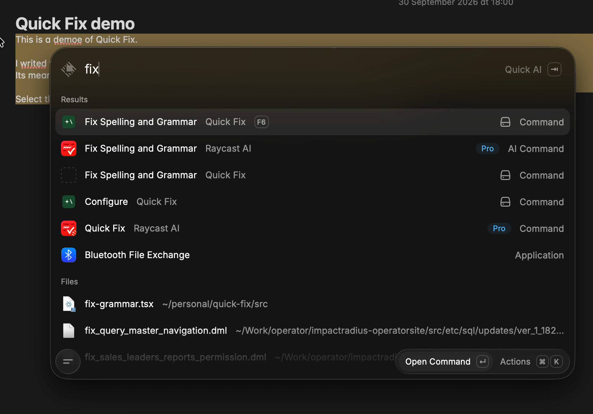
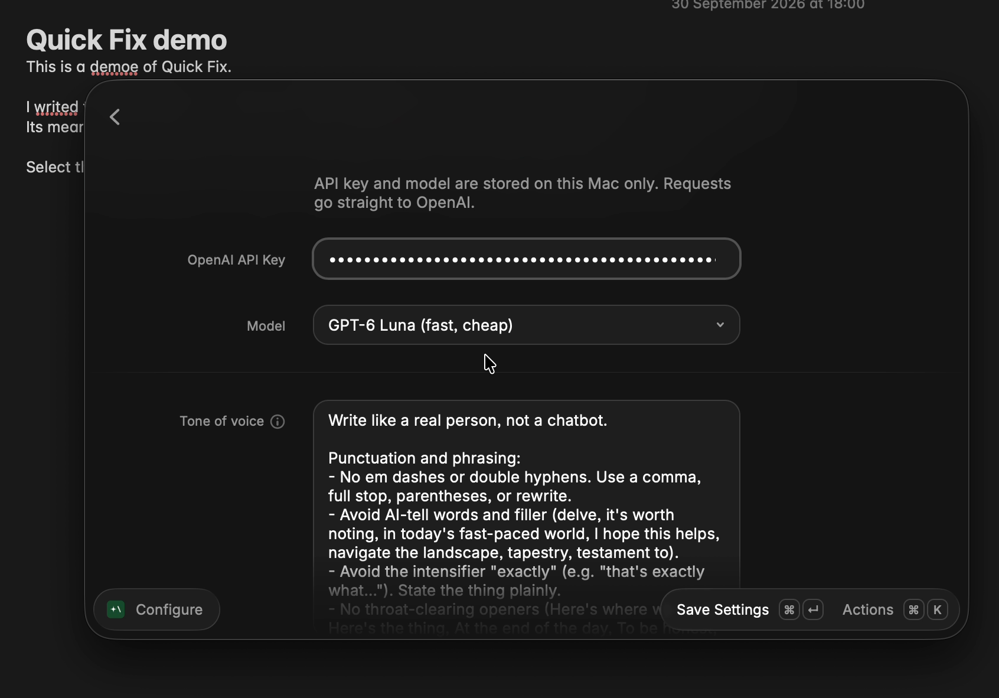
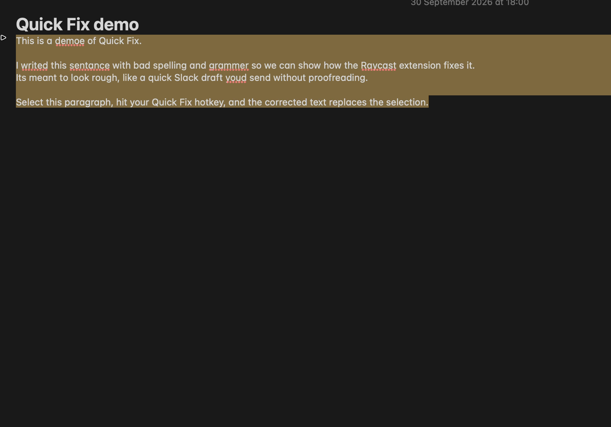
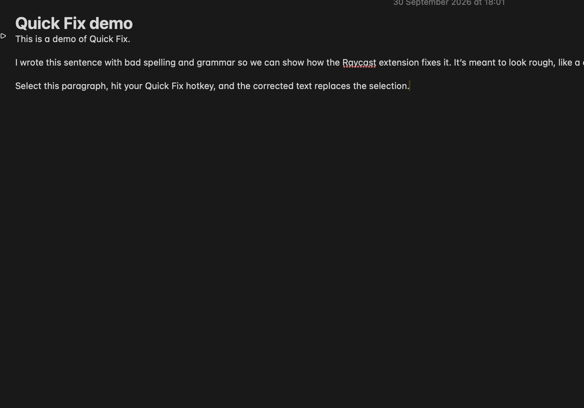

# Quick Fix

Raycast extension that fixes spelling and grammar on selected text — using **your own OpenAI API key**, called directly from your Mac (not Raycast’s AI proxy).

[](docs/media/demo.mp4)

[▶ Watch demo (35s, ~750 KB)](docs/media/demo.mp4)

## What it can do

| | |
|---|---|
| Fix in place | Select text in any Mac app → run the command → corrected text replaces the selection |
| Bring your own key | OpenAI requests leave your Mac straight to OpenAI |
| Pick a model | GPT-6 Luna (default), Sol, or GPT-5.6 Terra |
| Tone of voice | Custom rules applied on every fix (anti–AI-tell defaults included) |
| Hotkey | Assign one in Raycast (e.g. F6) for a near–Quick Fix feel |

Not in scope (yet): rich-format preserve, before/after diff UI, multi-provider, Raycast Pro’s double-tap modifier.

## How it works

```
Any Mac app
   select text
        │
        ▼
Raycast hotkey / command
        │
        ├─ read selection (clipboard saved & restored)
        ├─ POST OpenAI chat.completions with your key
        │     system: copy-edit + your tone-of-voice rules
        └─ Clipboard.paste(corrected text)  →  replaces selection
```

1. **Selection** — `getSelectedText()`, with your previous clipboard restored afterward
2. **Prompt** — fixed copy-editor instructions plus your **Tone of voice** rules from Configure
3. **Replace** — result is pasted over the selection; HUD shows `Fixed`

Privacy: API key and settings live in Raycast `LocalStorage` on this Mac. Nothing is sent through Raycast’s servers.

## Screenshots

**Configure** — API key, model, and tone of voice:



**Before** — draft with typos selected:



**Run the command** (search or hotkey):


**After** — selection replaced in place:



## Setup

1. `npm install`
2. `npm run dev` (leave running while iterating)
3. Raycast → **Configure** → paste API key, pick model, tweak tone → Save
4. Optional: Extensions → Quick Fix → **Fix Spelling and Grammar** → Record Hotkey

Before publishing to the Raycast Store, set `"author"` in `package.json` to your Raycast username.

## Usage

1. Select text in any Mac app
2. Run **Fix Spelling and Grammar** (or your hotkey)
3. Corrected text replaces the selection

If nothing is selected, or the API key is missing, you get a toast instead of a silent no-op.

### Configure

| Field | Notes |
|---|---|
| OpenAI API Key | Stored locally on this Mac |
| Model | Dropdown (`gpt-6-luna` default; also Sol / Terra) |
| Tone of voice | Rules applied on every fix; **Reset Writing Style** restores the built-in default |

## Docs

- [MVP plan](docs/plan-mvp.md)

## License

MIT
